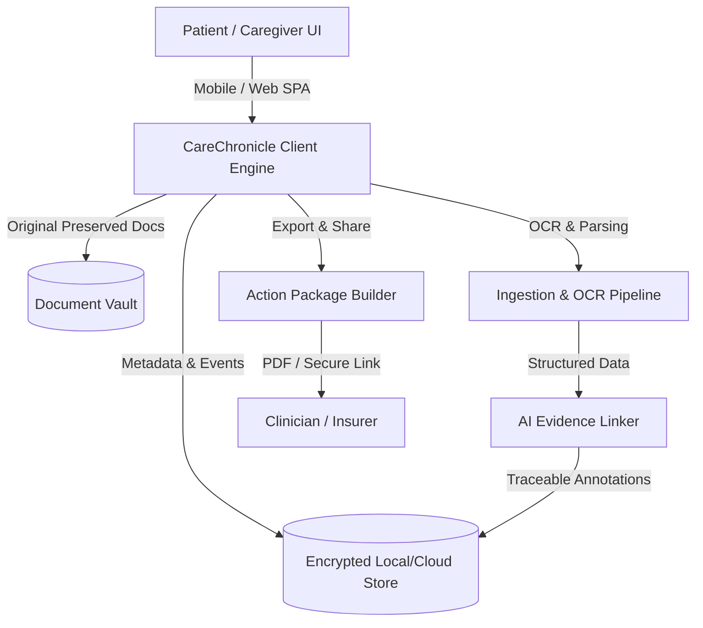

# 🌸 CareChronicle

> **Organize the records. Preserve the story. Simplify the journey.**

CareChronicle is a patient-owned digital medical record and care-organization platform. It transforms fragmented medical documents, appointment notes, treatment timelines, and insurance claims into a unified, evidence-linked, and privacy-first care journey.

---

## 📌 Overview

Patients managing complex, chronic, or multi-specialist care often face scattered health data—PDFs, portal exports, physical scans, doctor notes, and billing receipts. **CareChronicle** bridges this gap by acting as a personal health operating system where every piece of medical evidence is preserved in its original form, organized chronologically, and summarized with verifiable AI assistance.

---

## 🎯 Core Product Pillars

1. **🔒 Patient Ownership & Privacy-First**  
   Patients hold complete sovereignty over their medical history. Zero public-by-default sharing, granular role-based permissions, and client-side encryption.
   
2. **📄 Original Preservation (Source of Truth)**  
   Original documents (scans, PDFs, images) are never overwritten or altered. Machine extractions and AI suggestions exist strictly as annotations layer-linked to the original source.

3. **🤖 Evidence-Linked AI (Zero Unsupported Inferences)**  
   CareChronicle AI does not guess or diagnose. Every AI-generated summary or trend is explicitly traceable with a single tap to the original medical document.

4. **🗺️ Story & Context Continuity**  
   Health records are grouped by care episodes and timeline events rather than isolated files, enabling patients and clinicians to understand *what happened* and *what changed*.

---

## ✨ Key Features

### 📁 Vault & Smart Ingestion
- **Multi-Format Upload**: Preserves PDFs, images, clinical notes, and lab reports.
- **OCR & Metadata Extraction**: Automatically parses document dates, providers, facility names, and record types while preserving original files.
- **Multi-Case Organization**: Manages distinct care profiles (e.g., self, aging parent, child) without cross-filing data.

### 📅 Appointment Workspace & Preparation
- **"Since Last Visit" Delta View**: Highlights new lab results, medication updates, and care events since the previous appointment.
- **Patient Question Builder**: Formulate and rank questions prior to consultation.
- **One-Tap Clinical Bundle**: Generate concise 1-page appointment summaries for quick doctor review.

### 📜 Timeline & Care Episodes
- **Chronological Care Mapping**: Visual journey mapping medical events, hospitalizations, procedures, and test results.
- **Milestone & Delta Tracking**: Compare lab trends over time with direct links to lab reports.

### 📦 Action Packages (One-Click Curated Sharing)
- **Second Opinion Package**: Curated chronological clinical packet with source attachments.
- **Insurance & Claims Package**: Organize episode documents, bills, and discharge summaries for claims.
- **Clinician Summary**: Concise longitudinal summary built specifically for rapid provider onboarding.

### 🛡️ AI Trust & Provenance System

CareChronicle enforces a 5-tier visual hierarchy to ensure absolute transparency:

| Information State | Meaning | Visual UI Treatment |
| :--- | :--- | :--- |
| **Original** | Direct source artifact (PDF/Image) | Full source document badge |
| **Extracted** | Machine-read text or values (OCR) | Extracted tag + source link |
| **User-Entered** | Patient-added or corrected data | "Added/Verified by you" indicator |
| **Suggested** | AI-inferred classification/linking | "Suggested" badge + Accept/Edit action |
| **Generated** | AI-synthesized summary text | "AI-Generated" header + evidence link |

---

## 🎨 Design System & Aesthetics

CareChronicle features a distinctive, soothing **Soft Pink & Warm Earth** palette designed to reduce patient stress during care coordination:

- **Soft Pink (`#FFF5F7`)**: Calming background canvas.
- **Warm Rose (`#FFB6C1`)**: Primary brand accents & key highlights.
- **Deep Mauve (`#5A3D48`)**: High-contrast, legible typography.
- **Accent Coral (`#E05A70`)**: Interactive buttons and status indicators.

---

## 🏗️ System Architecture

---

## 📚 Specification Documents

For complete architectural specifications, user flows, and design guidelines, refer to the included design artifacts:
- 📖 [CareChronicle Professional PRD v2.0](file:///Users/maithilipawar/Project/CareChronicle/CareChronicle_Professional_Detailed_PRD_v2.0.pdf)
- 🎨 [CareChronicle UX/UI & Architecture Diagrams v2.0](file:///Users/maithilipawar/Project/CareChronicle/CareChronicle_Design_Approach_v2.0_Pink_Architecture_Diagrams%20\(1\).pdf)

---

## 📜 License

This project is licensed under the [GNU General Public License v3.0](file:///Users/maithilipawar/Project/CareChronicle/LICENSE).
