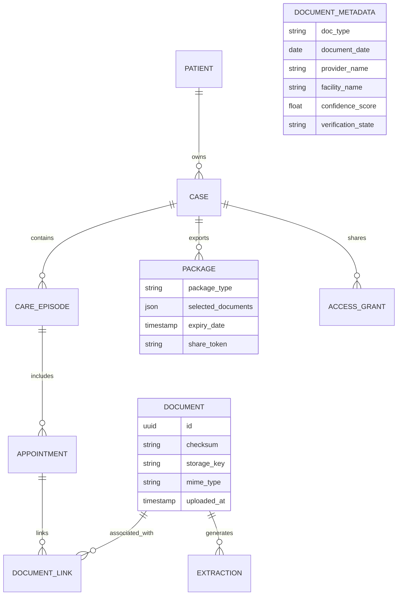
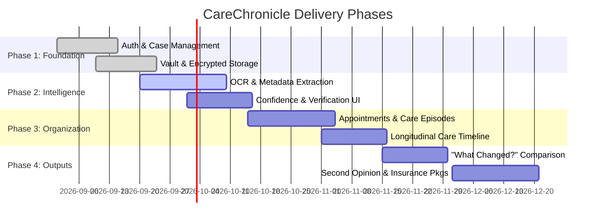

# 🌸 CareChronicle

<div align="center">


**Organize the records. Preserve the story. Simplify the journey.**

*A patient-owned digital medical record & care organization platform that turns fragmented medical documents into a structured, evidence-linked longitudinal story.*

</div>

---

## 📌 Executive Summary

Complex healthcare journeys—such as oncology treatments, chronic disease management, and multi-specialist care—accumulate records across hospitals, labs, pharmacies, imaging centers, and insurance providers. These arrive as PDFs, physical paper scans, phone photos, and portal downloads.

**CareChronicle** is built on a fundamental thesis:
> 💡 *AI is the engine; the persistent medical-record workflow is the product.*

CareChronicle creates a persistent organizational layer around the patient's records. It preserves original source documents, extracts structured metadata, links files to specific appointments and care episodes, builds a longitudinal timeline, and generates purpose-built documentation packages for consultations, second opinions, and insurance claims.

---

## 🎯 Core Product Philosophy & Design Principles

```
  ┌─────────────────────────────────────────────────────────────────────────┐
  │                           CORE PHILOSOPHY                               │
  │   "AI is the engine; the persistent medical-record workflow is the product"│
  └─────────────────────────────────────────────────────────────────────────┘
                                     │
      ┌──────────────────────────────┼──────────────────────────────┐
      ▼                              ▼                              ▼
🔒 **Patient Control**         📄 **Source Traceability**      🗺️ **Event Continuity**
Patient owns all data.        Every derived insight links    Records filed around care
Zero public default sharing.   back to the original file.     events, not arbitrary folders.
```

1. **Trust Before Automation**: AI proposes relationships and extractions; humans verify consequential fields.
2. **Original Evidence First**: Original documents (scans, PDFs) are immutable sources of truth. Machine extractions exist as traceable annotations.
3. **Appointment as the Core Filing Unit**: Documents, prescriptions, lab reports, and billing receipts belong to care episodes and appointments.
4. **Explicit Uncertainty (Show Gaps)**: Low-confidence extractions surface review prompts rather than making silent assumptions.
5. **Strict Clinical Boundary**: CareChronicle organizes, indexes, and summarizes. It **never** diagnoses, recommends treatments, or adjusts medication dosages.

---

## 🔍 Problems Solved (P-01 to P-09)

| ID | Problem | Product Solution |
| :--- | :--- | :--- |
| **P-01** | **Scattered Records** | Unified vault ingesting PDFs, images, and camera scans. |
| **P-02** | **Poor Chronology** | Automatic longitudinal timeline mapping care events. |
| **P-03** | **Weak Relationships** | Linking prescriptions, lab reports, and receipts directly to appointments. |
| **P-04** | **Repeated Searching** | Hybrid search across metadata, OCR text, and semantic concepts. |
| **P-05** | **Context Loss** | "What Changed?" side-by-side record comparison. |
| **P-06** | **Caregiver Burden** | Granular role-based caregiver access and collaborative case management. |
| **P-07** | **Second-Opinion Friction** | One-click Second Opinion Package builder with source document indices. |
| **P-08** | **Insurance Friction** | Episode-level documentation builder with explicit "found vs missing" indices. |
| **P-09** | **AI Trust Risk** | 5-tier visual provenance hierarchy with source-document deep-linking. |

---

## ✨ Key Signature Workflows

### 1. 📅 Appointment Preparation & Workspace
- **"Since Last Visit" Delta View**: Automatically aggregates new lab results, clinical notes, and medication updates since the previous consultation.
- **Patient Question Builder**: Allows patients/caregivers to rank questions prior to consultations.
- **1-Page Doctor Packet**: Generates a source-grounded summary optimized for rapid clinician review.

### 2. 🔬 "What Changed?" Record Comparison
- Compares successive lab reports or clinical notes side-by-side.
- Highlights extracted numeric changes, statement differences, and medication updates.
- **Safety Rule**: Distinguishes source facts from interpretation without delivering diagnostic advice.

### 3. 📦 Action Package Builders
- **Second Opinion Package**: Curates chronological medical history packets grouped by category (Pathology, Imaging, Labs, Consultations) with attached original PDFs.
- **Insurance Documentation Package**: Gathers episode bills, hospital discharge summaries, pharmacy receipts, and pre-authorizations with transparent document presence indicators.
- **Clinician Summary**: Concise longitudinal summary for on-boarding new specialists.

---

## 🛡️ AI Trust & Provenance System

CareChronicle enforces a strict 5-tier visual hierarchy to ensure patients and clinicians never confuse machine inference with source evidence:

| Tier | State | Meaning | Visual UI Treatment |
| :--- | :--- | :--- | :--- |
| **1** | **Original** | Direct source artifact (PDF/JPEG scan) | Solid source badge + viewer link |
| **2** | **Extracted** | Machine-read value (OCR) | Extracted tag + source link |
| **3** | **User-Entered** | Added or confirmed by patient/caregiver | "Added by you" badge |
| **4** | **Suggested** | AI-inferred category or relationship | "Suggested" badge + Accept/Edit prompt |
| **5** | **Generated** | Synthesized AI summary text | "AI-Generated" header + mandatory source links |

---

## 🎨 Visual System & Theme (Deep Pink Identity)

CareChronicle uses a distinctive **Pink-Led Theme** designed to evoke warmth, empathy, and professional clarity without feeling informal:

```css
/* CareChronicle Design System Tokens */
:root {
  --primary-pink:    #C2185B; /* Primary actions, active navigation */
  --dark-pink:       #8E1748; /* Headings, strong contrast */
  --accent-pink:     #E91E63; /* Secondary interactive highlights */
  --light-pink:      #FCE4EC; /* Callout backgrounds, selected cards */
  --soft-pink:       #F8BBD0; /* Borders, dividers, subtle accents */
  --neutral-surface: #FFF7FA; /* Base background canvas */
  --text-main:       #26202A; /* Primary typography */
  --text-muted:      #6B6570; /* Secondary metadata */
  
  /* Semantic Status Tokens (Never override text labels) */
  --status-success:  #287A57; /* Confirmed / Verified state */
  --status-warning:  #9A6700; /* Needs review / Low confidence */
  --status-error:    #A33A3A; /* Destructive / Failed OCR */
}
```

---

## 🏗️ System Architecture

```mermaid
flowchart TD
    subgraph Client ["Client Experience Layer (Mobile PWA & Responsive Web)"]
        UI["Home • Medical Vault • Timeline • Appointments • Packages • Access"]
    end

    subgraph AppServices ["Application Services Layer"]
        AUTH["Auth Service"]
        DOCS["Document Service"]
        SEARCH_SRV["Hybrid Search Engine"]
        SHARE["Sharing & Access Control"]
        EXPORT["Package Generator"]
    end

    subgraph Intelligence ["Async Document Intelligence Pipeline"]
        INGEST["Upload & Malware Scan"]
        NORM["Format Normalization"]
        OCR["OCR & Layout Analysis"]
        CLASS["Document Classification"]
        EXTRACT["Metadata & Entity Extraction"]
        LINKER["Care Episode Matcher"]
        CONF["Confidence Scoring & Human Verification"]
    end

    subgraph DataStore ["Core Storage & Security Layer"]
        OBJ[("Encrypted Object Store (Original PDFs/Scans)")]
        DB[("Relational DB (Cases, Events, Links)")]
        AUDIT[("Immutable Audit Log")]
    end

    Client -->|REST API / HTTPS| AppServices
    AppServices --> INGEST
    INGEST --> NORM --> OCR --> CLASS --> EXTRACT --> LINKER --> CONF
    CONF -->|Verified Entities| DB
    INGEST -->|Raw Files (AES-256)| OBJ
    AppServices -->|Access Logs| AUDIT
```

---

## 📊 Data Model & Core Entities



---

## 🌐 API Surface Overview

| Domain | Base Endpoint | Description |
| :--- | :--- | :--- |
| **Authentication** | `POST /auth/*` | Session management, OAuth, MFA & Biometric enrollment |
| **Patient Profile** | `/patients/*` | Case creation, patient profiles, and case switching |
| **Document Vault** | `/documents/*` | Upload, metadata management, source download, and deletion |
| **Processing** | `/documents/{id}/processing` | Processing pipeline status, confidence scores, reprocessing |
| **Appointments** | `/appointments/*` | Dossier management, linked records, and pre-visit question builder |
| **Timeline** | `/cases/{id}/timeline` | Chronological event retrieval with linked source evidence |
| **Hybrid Search** | `/search` | Full-text OCR, metadata filtering, and natural language retrieval |
| **Package Builder** | `/packages/*` | Second Opinion, Insurance, and Doctor export generation |
| **Caregiver Access** | `/access/*` | Granular permission assignment, role management, and revocation |
| **Audit Logs** | `/audit/*` | Security and access audit history |

---

## 🔒 Security, Privacy & Compliance

- **Data Encryption**: AES-256 for data at rest; TLS 1.3 for data in transit. Separated key management.
- **Granular Permissions**: Read, Contribute, Export/Share, and Owner roles for family caregivers.
- **Explicit Sharing & Expiry**: Controlled link creation with configurable access duration and audit logging.
- **Zero-Data Loss Guarantee**: Async processing failures never affect the safety or availability of original files.
- **User Ownership & Erasure**: Full patient control over data export (ZIP bundles) and permanent deletion.

---

## 🗺️ Product Roadmap



---

## 📄 Project Documentation Links

- 📋 [CareChronicle Professional PRD v2.0](file:///Users/maithilipawar/Project/CareChronicle/CareChronicle_Professional_Detailed_PRD_v2.0.pdf)
- 🎨 [CareChronicle Design Approach & Architecture Diagrams v2.0](file:///Users/maithilipawar/Project/CareChronicle/CareChronicle_Design_Approach_v2.0_Pink_Architecture_Diagrams%20\(1\).pdf)
- ⚖️ [GNU General Public License v3.0](file:///Users/maithilipawar/Project/CareChronicle/LICENSE)

---

<div align="center">
  <sub>Built with care for patients and caregivers everywhere.</sub>
</div>
